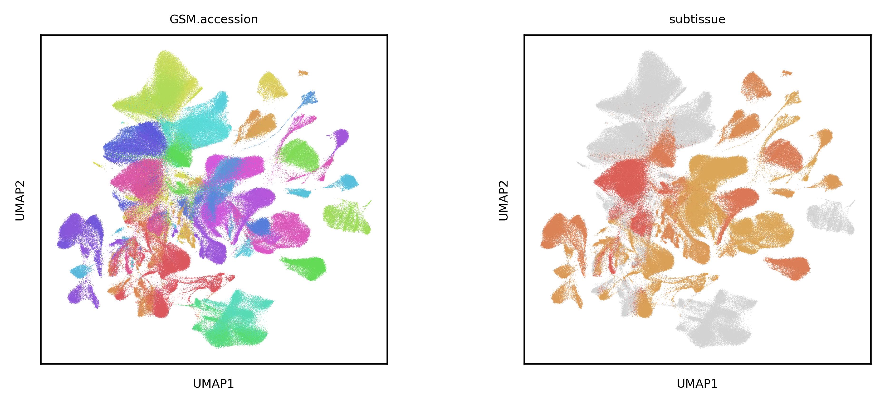

# **scMuscle2:** single-cell muscle transcriptomics across species
In the first scMuscle project, we attempted to gain a better understanding of the constituent cell types of murine skeletal muscle. In this update, we aim to expand the scope, resolution, and depth of that view, and to improve the availability of our analyses to the greater muscle/single-cell communities.

Draft of the mouse compendium, colored by sample ID (~1.2M cells/nuclei):

Draft of the human compendium, colored by sample ID (~875k cells/nuclei):

# Table of contents:
<!---toc start-->
  * [Include your data](#how-to-include-your-data-in-scMuscle2)
  * [Description of meta data](#description-of-meta-data)
  * [Workflow](#workflow)
  * [Citation info](#citation-info)
<!---toc end-->

# How to include your data in scMuscle2
We made a [quick google survey](https://forms.gle/rm6R9hbTAtrpm8rcA) to simplify sharing metadata. Only publicly available data will be included in this study, so please to upload to GEO/SRA!

See [the metadata](https://github.com/mckellardw/scMuscle2/blob/main/scMuscle2_metadata_v1-0.csv) for datasets we have already found. Be sure to check the `include` and `comments` columns to see if we have had issues with your data, and please send any corrections either via email (see below) or as a pull request in this repo. Thanks!

Please send any questions to either David McKellar (dwm269@cornell.edu) or to our official scMuscle email address (scmuscle@cornell.edu).

## Datasets to add:
- None in the queue! Send me more data please!

## Description of meta data
#### Source/citation info:
- **source.label** - shorthand for the publication from which this data was taken (first author's last name plus year final manuscript was published)
- **sample** - sample ID, specific to each lane of a 10x Chromium run (string of characters with no spaces, no periods, and no hyphens/dashes)
- **description** - Brief description of the sample. Not used by any pipeline.
- **include** - Whether or not to include the sample in the analysis (True/False)
- **source** - This is an abbreviate citation for each publication (Author et al, Journal, year)

#### Biological metadata & experimental conditions
- **species** - species from which the sample was derived (Genus species)
- **sex** - ("M"/"F")
- **age** - measured in... days? weeks? months? #TODO
- **tissue** - #TODO
- **subtissue** - #TODO

#### Technical info:
- **chemistry** - This column specifies what chemistry/method was used to prepare the data (10x Genomics Chromium v1/v2/v3/v3.1, or other methods). ***Note*** For lots of samples where chemistry was not stated beyond "10x Genomics", I used the length of R1 to determine if the sample was v2 or v3 (v3 and v3.1 use the same R1 length, so specifying isn't as important; please let me know if you find an error though!). See `resources/chemistry_sheet.csv` for details on how this is used in alignment (`align_snake`).
- **sequencer** - type of sequencer used

#### Accession info:
- **file.format** - This column contains the file format in which authors originally uploaded their data. This is used by the `align_snake` pipeline to download and reformat each file so that they may be re-aligned to a common reference. Options:
  - "fastq"
  - "bam"
  - "aws" - file is downloaded w/ `wget` and renamed to match the accession info `#TODO`
  - "local" - option for files that you have downloaded manually, or files that aren't public (yet...) `#TODO`
- **GSE.accession** - Gene Expression Omnibus (GEO) project accession number (GSE#######)
- **GSM.accession** - GEO sample accession number (GSM#######). *Note* this ID is used for pooling fastq's (SRR #'s) from samples for which authors uploaded multiple files
- **SRR.accession** - This column contains the "SRR#########" IDs for each run. These IDs are important because they are used to download the raw sequencing data for each sample (see `align_snake`). For samples which have more than one run, the SRR numbers are delimited with a semi-colon (;). ("SRR#########" or "ERR########")
- **SAMN.accession** - `INSERT_DESCRIPTION_HERE`
- **other.accession** - `INSERT_DESCRIPTION_HERE`
- **file.link** - link that can be used to directly download files with `wget`

## Sources & keywords used to find samples
- [NCBI/GEO](https://www.ncbi.nlm.nih.gov/geo/) - keywords used:
  - (muscle) AND (single-cell)
  - (tendon) AND (single-cell)
  - (limb) AND (single-cell)
  - (skeletal) AND (single-cell)
  - (cartilage) AND (single-cell)
- [CNBC/NGDC](https://ngdc.cncb.ac.cn/) - keywords used:
  -
- [10x Genomics - 'Publications'](https://www.10xgenomics.com/resources/publications)
- [panglaoDB](https://panglaodb.se/)
- [Broad Single-Cell Portal](https://singlecell.broadinstitute.org/single_cell)
- [Svensson et al Database](http://www.nxn.se/single-cell-studies/gui)
- [Single-Cell Expression Atlas](https://www.ebi.ac.uk/gxa/sc/home)
- [Human Cell Atlas Data Portal](https://data.humancellatlas.org/explore/projects)
- [AWS page for Tabula Muris](https://s3.console.aws.amazon.com/s3/buckets/czb-tabula-muris-senis?region=us-west-2&prefix=10x/FASTQs/&showversions=false)

## Other useful tools for exploring sequencing data
- [ffq](https://github.com/pachterlab/ffq) - used to clarify metadata, fill out accession info. Incorporated into the `align_snake` pipeline
- [fastqerq-dump](https://github.com/ncbi/sra-tools/wiki/HowTo:-fasterq-dump)
- [parallel-fastq-dump](https://github.com/rvalieris/parallel-fastq-dump)

## Single-cell analysis tools
**#TODO**
- [Cellbender](https://github.com/broadinstitute/CellBender) - Ambient RNA removal, [published](https://doi.org/10.1101/791699)
- [Scrublet](https://github.com/swolock/scrublet) - doublet ID and removal, [published](https://www.sciencedirect.com/science/article/pii/S2405471218304745)
- [Scanpy](TODO)
-

# **Workflow**
`align_snake` - snakemake workflow to automate everything between metadata collectino and count matrix preprocessing
1. Download raw sequencing data for all samples (`ffq`,`parallel-fastq-dump`)
2. Build reference genomes (`gget`, `STAR`)
3. Align sequencing data (`STAR`, `kallisto`?)  
4. 
5. Integrate samples for each species separately (`Seurat`/`scanpy`/`Harmony`/etc)
6. Cross-species integrative analysis (`SAMmap`)

## "tissue" annotations
- Using tiered tissue annotations:
  - Muscle
    - Hindlimb
    - Tibialis Anterior
    - Quadriceps
    -
  - Tendon
    -
  - Cartilage
    -

# Useful references:
- Cross-species integration benchmark study [ [link](https://www.biorxiv.org/content/10.1101/2022.09.27.509674v1) ]
  - Counldn't find BENGAL code, but found this snakmake from the authors' lab: https://github.com/Functional-Genomics/cross-species-cellgroup-comparison
- Batch-correction benchmarking with [scIB](https://github.com/theislab/scib)