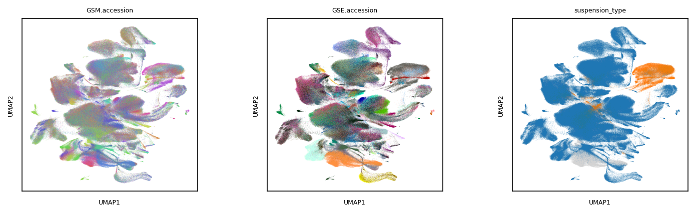
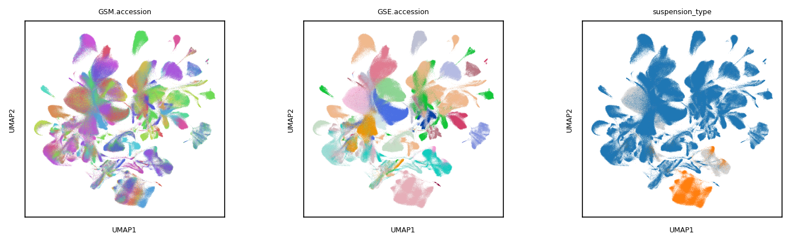

# **scMuscle2:** single-cell muscle transcriptomics across species
In the first scMuscle project, we attempted to gain a better understanding of the constituent cell types of murine skeletal muscle. In this update, we aim to expand the scope, resolution, and depth of that view, and to improve the availability of our analyses to the greater muscle/single-cell communities.

Draft of the mouse compendium, colored by sample ID (1,529,958 cells/nuclei):  


Draft of the human compendium, colored by sample ID (1,048,507 cells/nuclei):  


# Table of contents:
<!---toc start-->
  * [Include your data](#how-to-include-your-data-in-scMuscle2)
  * [Description of meta data](https://github.com/mckellardw/scMuscle2/blob/main/metadata_info.md)
  * [Workflow](#workflow)
  * [Citation info](#citation-info)
<!---toc end-->


# How to include your data in scMuscle2
See [the metadata](https://github.com/mckellardw/scMuscle2/blob/main/scMuscle2_metadata_v1-0.csv) for datasets we have already found. Be sure to check the `include` and `comments` columns to see if we have had issues with your data, and please send any corrections either via email (see below) or as a pull request in this repo. Thanks!

Please send any questions to either David McKellar (dmckellar@nygenome.org) or to the official scMuscle email address (scmuscle@cornell.edu).

## Datasets to add:
### Single-cell/nuc data
- https://journals.biologists.com/jcs/article/136/8/jcs260913/307168/Distinct-myofibre-domains-of-the-human
  - E-MTAB-12529 and E-MTAB-12530
- https://bmcbiol.biomedcentral.com/articles/10.1186/s12915-023-01519-z 
  - pig data 
- https://pubmed.ncbi.nlm.nih.gov/37102148/
  - multiome iPSC/hMuSC data
- https://pubmed.ncbi.nlm.nih.gov/37235502/
  - Data not available?

### Spatial data
- Defining the spatial-molecular map of fibrotic tendon healing and the drivers of Scleraxis-lineage cell fate and function - https://www.ncbi.nlm.nih.gov/geo/query/acc.cgi?acc=GSE216214 (Visium datasets)
- Rabbit rotator cuff Visium datasets - https://josr-online.biomedcentral.com/articles/10.1186/s13018-022-03326-8
<!-- - None in the queue... Send me more data please! -->

## Sources & keywords used to find samples
- [NCBI/GEO](https://www.ncbi.nlm.nih.gov/geo/) - keywords used:
  - (muscle) AND (single-cell)
  - (tendon) AND (single-cell)
  - (limb) AND (single-cell)
  - (skeletal) AND (single-cell)
  - (cartilage) AND (single-cell)
- [CNBC/NGDC](https://ngdc.cncb.ac.cn/)
- [10x Genomics - 'Publications'](https://www.10xgenomics.com/resources/publications)
- [panglaoDB](https://panglaodb.se/)
- [Broad Single-Cell Portal](https://singlecell.broadinstitute.org/single_cell)
- [Svensson et al Database](http://www.nxn.se/single-cell-studies/gui)
- [Single-Cell Expression Atlas](https://www.ebi.ac.uk/gxa/sc/home)
- [Human Cell Atlas Data Portal](https://data.humancellatlas.org/explore/projects)
- [AWS page for Tabula Muris](https://s3.console.aws.amazon.com/s3/buckets/czb-tabula-muris-senis?region=us-west-2&prefix=10x/FASTQs/&showversions=false)

## Other useful tools for exploring sequencing data
- [ffq](https://github.com/pachterlab/ffq) - used to clarify metadata, fill out accession info. Incorporated into the `align_snake` pipeline
- [fastqerq-dump](https://github.com/ncbi/sra-tools/wiki/HowTo:-fasterq-dump)
- [parallel-fastq-dump](https://github.com/rvalieris/parallel-fastq-dump)

## Single-cell analysis tools
**#TODO**
- [Cellbender](https://github.com/broadinstitute/CellBender) - Ambient RNA removal, [published](https://doi.org/10.1101/791699)
- [Scrublet](https://github.com/swolock/scrublet) - doublet ID and removal, [published](https://www.sciencedirect.com/science/article/pii/S2405471218304745)
- [Scanpy](TODO)
-


# **Workflow**
`align_snake` - snakemake workflow to automate everything between metadata collectino and count matrix preprocessing
1. Download raw sequencing data for all samples (`ffq`,`parallel-fastq-dump`,`wget`)
2. Build reference genomes (`gget`, `STAR`)
3. Align sequencing data (`STARsolo`)  
4. QC samples individually
5. Integrate samples for each species separately (`scanpy`/`Harmony`/etc)
6. Manually re-annotate clusters/cell types

#TODO
7. Cross-species integrative analysis (`SAMmap`)

# Download the dataset from cellxgene w/ `gget`
[gget](https://github.com/pachterlab/gget)

#TODO
```
$ gget setup cellxgene # setup only needs to be run once
$ gget cellxgene --gene ACE2 SLC5A1 --tissue lung --cell_type 'mucus secreting cell' -o example_adata.h5ad
```

# "tissue" & "subtissue" annotations
#TODO
- Using tiered tissue annotations:
  - muscle
    - hindlimb
    - tibialis anterior
    - quadriceps
    - gastrocnemius
    - soleus
    - rectus femoris
    - gluteus minimus
    - vastus lateralis
    - Flexor hallucis longus
    - serratus
    - orbicularis oris
    - external oblique
    - rectus abdominus
    - trapezius
    - lower abdominal muscle
    - triceps
    - plantaris
    - embryonic forelimb
    - tail
    - pharynx
    - diaphragm
    - tongue
    - muscle stem cell
    - tumor
    - xenograft
    - myoblasts
    - cell line
    - iPSC / psc-derived
    - organoid
  - tendon
    - achilles
    - flexor digitorus longus tendon
    - enthesis
    - iPSC
  - cartilage
    - #TODO


# Useful references:
- Batch-correction benchmarking with [scIB](https://github.com/theislab/scib)
- Cross-species integration benchmark study [ [link](https://www.biorxiv.org/content/10.1101/2022.09.27.509674v1) ]
  - Counldn't find BENGAL code, but found this snakmake from the authors' lab: https://github.com/Functional-Genomics/cross-species-cellgroup-comparison
